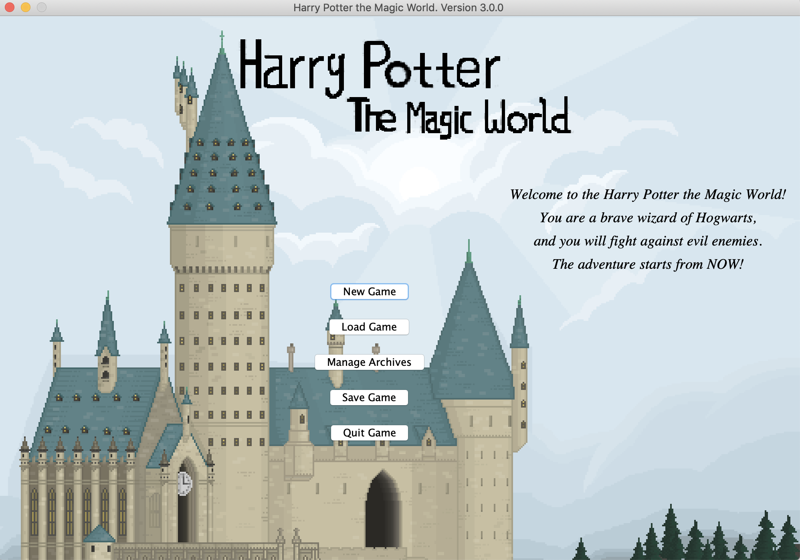
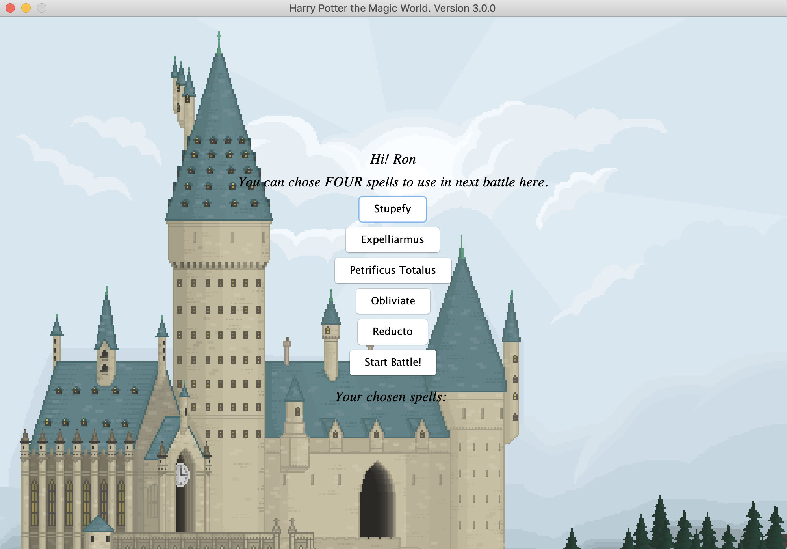
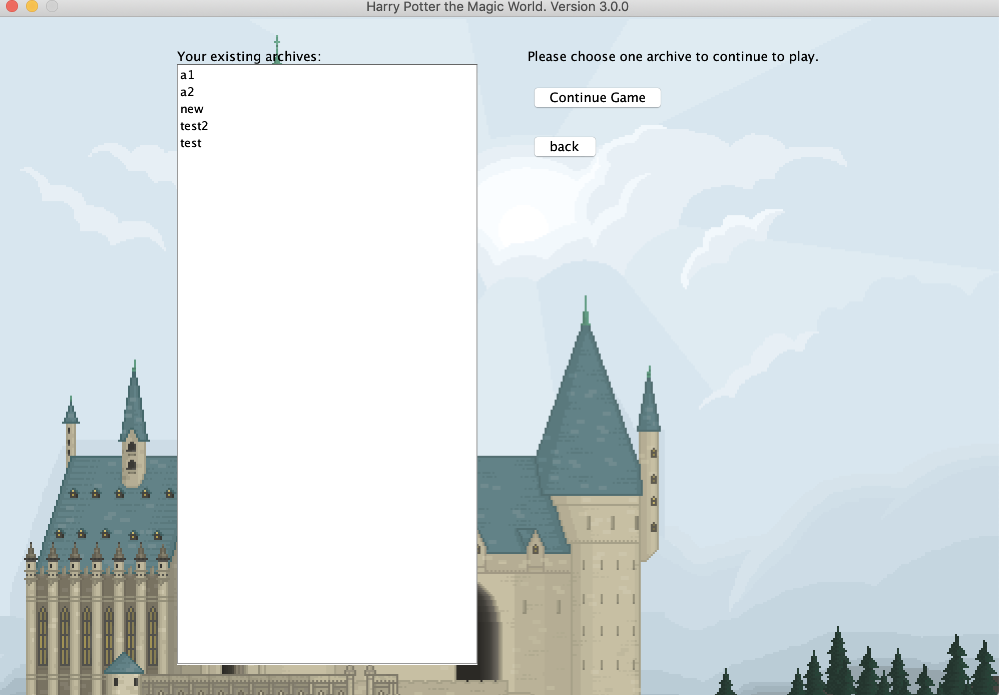
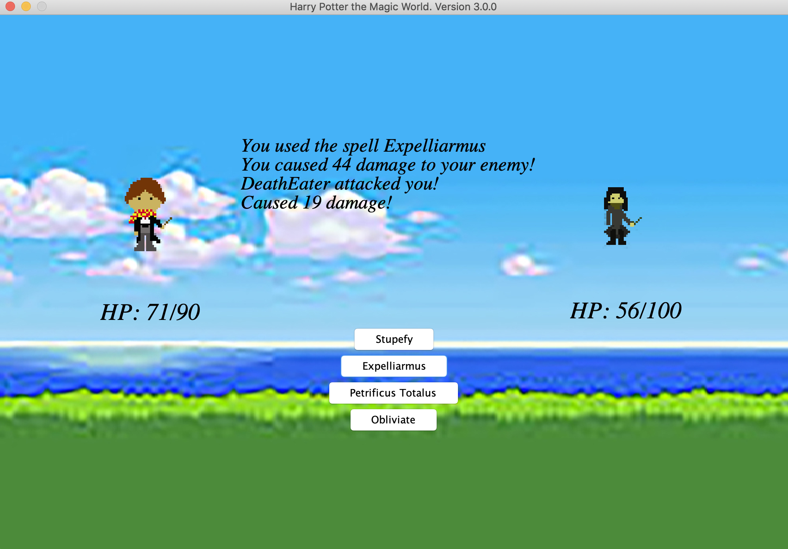

# Harry Potter the Magic World 

## Introduction

This is a simple *Harry Potter* theme turn-based role-playing video game. I named it *Harry Potter the Magic World*. 
Players can choose their favourite wizard to fight against evil enemies by choosing a spell to in each round. Different 
spells have different ATK\(attack) to the enemy, and if the HP\(health point) of a character less than or equals to 
zero, then the character dies. Each wizard and enemy also has unique HP and ATK from others, so the difficulty of each 
battle is distinct. Moreover, there is a simple plot of the game to make sure it is not boring. To be specific, 
the enemies the player will encounter will get stronger and stronger, and the player must beat previous ones to fight 
against the next enemy. However, the player's attacking point is also getting larger and larger after each battle.
Everyone who is interested in *Harry Potter* can enjoy this game. This game can be expanded by 
adding more battles and more attracting plot, as well as different mode and more elements like shopping system can be 
added in the future maintenance. I picked this project because I am into playing video games and both of *Harry Potter* 
series books and movies attract me a lot. This is a demo version, so there are only three battles. However, it is not hard
and complicated to add more and more.

##User Stories
As a user, I want to be able to:
- create a new archive and add it to the saving slot.
- view all my archives and remove one or some of them.
- rename one of my archive
- save my game process into my current archive to a file.
- view all my archives and read one of them then continue to play.
- view wizards options and choose a wizard at the beginning of the game.
- view all the spells that I can use and choose four of them to use before each battle.
- know the HP of both my wizard and the enemy during each battle.
- view four of my chosen spells and use one of them to attack in the battle
- cause different damage to the enemy in each round even using the same spell.
- feel the difference when using different wizards and fighting against different enemies, \(i.e. each character has distinct HP and ATK).
- know if I win a battle. If I lose, I want to restart the battle.
- get stronger in the gaming process, which means my hp and attack point can increase 
  after each battle.
- view the plot of the game, which can make the game fun.
- go back to create/remove/read archive panel after each battle, and my data can be  automatically 
  saved.
- automatically save my data when I want to quit the game.

##Project Screen Shot

  
##Reference
https://github.students.cs.ubc.ca/CPSC210/TellerApp/commit/f7fa8a0ecd7fb591e2ea0930e1f882e0f93baab7
https://github.com/def-not-ys/BCS-Degree-Navigator
https://howtodoinjava.com/java/library/json-simple-read-write-json-examples/
https://blog.csdn.net/Grevi/article/details/79333283
https://blog.csdn.net/u014259820/article/details/78835739
https://blog.csdn.net/monkeyduck/article/details/11525771

Pictures:

https://www.pixilart.com/art/hogwarts-school-of-witchcraft-wizardry-0ee4c8f3f15053d
https://www.google.com/url?sa=i&url=https%3A%2F%2Fm.669pic.com%2Ftupian%2Fxiangsuyouxi.html&psig=AOvVaw2ormHNeAhCkxM0jL7ugdAB&ust=1613515461439000&source=images&cd=vfe&ved=0CAIQjRxqFwoTCPD2utP77O4CFQAAAAAdAAAAABAD
https://cdn.mos.cms.futurecdn.net/c630d2e738d3bb015c33a5a338108b21-1024-80.jpg.webp

